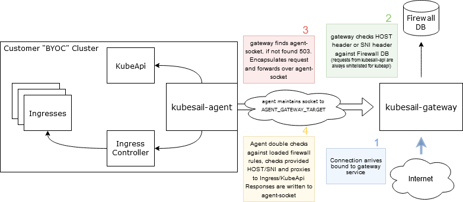

# Bring Your Own Cluster

Bring Your Own Cluster (BYOC) allows you to attach a Kubernetes cluster to KubeSail.com. You can attach any cluster, anywhere - from a Raspberry Pi at home, to a thousand-node cluster on AWS. Attaching a Cluster is accomplished by installing the KubeSail Agent, which is a small open-source application.

Once a cluster is attached to KubeSail.com, you can use it just like you use our Shared clusters - [deploy templates](https://kubesail.com/templates), [attach Repos](https://kubesail.com/repos), and [invite friends and coworkers](https://kubesail.com/clusters) to be either admins or namespaced users.

KubeSail.com can also forward kube-api and Ingress traffic to your cluster! This allows you to host internet-facing applications on your cluster, even if it does not have a reliable static IP address, and without having to forward ports. HTTPS traffic is kept secure and encrypted from the internet all the way to your cluster's applications - it's never decrypted by KubeSail (or the KubeSail agent).

Read more about [KubeSail Agent](https://github.com/kubesail/kubesail-agent) here, or take a look at a few overview diagrams at the bottom of this page.

# QuickStart
Create a free kubesail.com account by signing in with GitHub, then head to the [Clusters](https://kubesail.com/clusters/) section of the dashboard. Click the "Add Cluster" button at the top of the page, and follow the instructions. You will get a 1-line command to install the kubesail agent. Once installed, just click the "Verify Cluster" button. You can now manage applications, install templates, and easily expose HTTP traffic on your cluster.

# Using Kubectl with a BYOC cluster

You can fetch a Kubernetes configuration file from https://kubesail.com/config just like with any other cluster. You may need to use `kubectl --insecure-skip-tls-verify=true` or configure your cluster to be valid for your KubeSail cluster address.

# Configuring your BYOC Cluster

## Ingress Controller

KubeSail Gateway will forward traffic that it recieves to any connected Agent which is bound for valid domains you own. If the hostname of those requests is the name of your Kubernetes cluster's API, they will be forwarded to Kubernetes. However, if the hostname is _not_ your cluster's address, they will be optionally forwarded to your clusters [Ingress Controller](https://kubernetes.io/docs/concepts/services-networking/ingress-controllers/). By default, KubeSail agent will look for the [nginx ingress controller](https://kubernetes.github.io/ingress-nginx/), but it should work fine with any ingress system. To control where the traffic is sent, can you configure the following environment variables for the agent. Take a look at the `kubesail-agent` deployment in the `kubesail-agent` namespace:

```
            - name: INGRESS_CONTROLLER_NAMESPACE
              value: default
            - name: INGRESS_CONTROLLER_ENDPOINT
              value: ingress-nginx
```

## MicroK8s

### Common issues
Make sure to enable a few essential addons that are not enabled by default on Microk8s:

`microk8s enable dns ingress rbac storage`

### kubectl access
In Microk8s you'll need to edit `/var/snap/microk8s/current/certs/csr.conf.template` and add a line like the following under `[ alt_names ]`:

`DNS.100 = mycluster.kubesail--username.usw1.k8g8.com`

For example, my home cluster has a line like:
`DNS.100 = pasadena.erulabs.usw1.k8g8.com`.

Wait a few seconds and try `kubectl` using your config from `https://kubesail.com/config`.

> TIP: You can use different config files easily like `KUBECONFIG=configs/cluster1.yaml kubectl ...`

## K3s

### kubectl access
When installing K3s, you can use the `--tls-san` flag with the planned name from KubeSail. For example: `--tls-san mycluster.kubesail--username.usw1.k8g8.com`

## KubeSpray

### kubectl access
You can add a `supplementary_addresses_in_ssl_keys` to your group vars like:
```
supplementary_addresses_in_ssl_keys
  - mycluster.kubesail--username.usw1.k8g8.com
```
Re-run your KubeSpray playbook and it should automatically generate a new certificate with your new hostname included.

## EKS

### kubectl access
Unfortunately, EKS does not support adding additional sans at this time, although there is an [open request](https://github.com/aws/containers-roadmap/issues/413). Please use `kubectl --insecure-skip-tls-verify=true` or directly connect to the EKS cluster for now.

## If all else fails
You can use `kubectl --insecure-skip-tls-verify=true` for now, but please drop us a note in [our chat](https://gitter.im/KubeSail/community) and we'll figure it out together!

# Technical overview:

](img/gateway-overview.png)

# Request flow:

](img/byoc-request-flow.png)
