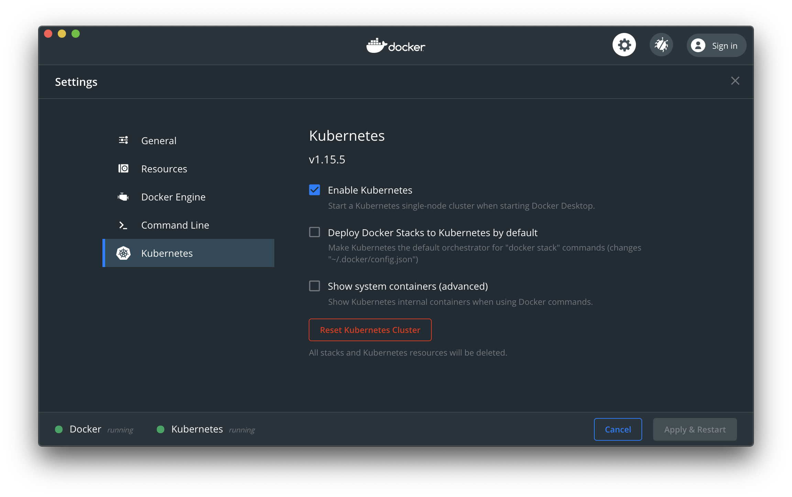

# Install Kubernetes

If you're working with a managed cloud provider like KubeSail, EKS, GKE, or Digital Ocean, Kubernetes comes pre-installed. If you're working with a local machine, here are some guides to install Kubernetes.

- [Docker Desktop](#docker-desktop) (easiest)
- [Microk8s](#microk8s)
- [K3s](#k3s)
- [Kubernetes the Hard Way](#kubernetes-the-hard-way)

## Docker Desktop

[Docker Desktop](https://www.docker.com/products/docker-desktop) is an application for MacOS and Windows machines for the building and sharing of containerized applications. It includes a standalone Kubernetes server and client. 

The Kubernetes server runs locally within your Docker instance, is not configurable, and is a single-node cluster. This is ideal for learning and local testing.

1. **Install and run Docker Desktop** 

    Download and install Docker Desktop for your machine's operating system.

    - [Install for MacOS](https://docs.docker.com/docker-for-mac/install/)
    - [Install for Windows](https://docs.docker.com/docker-for-windows/install/)

    Docker Desktop does not start automatically after installation, so search for the app and start it. A whale icon displays in the status bar when Docker Desktop is running and accessible from a terminal.

1. **Enable Kubernetes**

    Open the Docker Desktop menu by clicking the Docker icon in the status bar. To configure Docker settings, find **Preferences** for Mac and **Settings** for Windows. Under the **Kubernetes** tab, check **Enable Kubernetes** to run a Kubernetes single-node cluster when starting Docker Desktop.

    ](img/docker-desktop-preferences.png)

    Next, [link your cluster to KubeSail](/repo_builder/#step-2-link-your-cluster-to-kubesail) to manage the apps on your cluster.

## Microk8s

[Microk8s](https://microk8s.io/) is a lightweight version of Kubernetes designed for IOT and edge computing on a Linux operating system. For example, you can set up Microk8s on a Raspberry Pi to run a single-node cluster.

1. Prepare an SD card
1. Set up the WiFi
1. Log into the Raspberry Pi

Here is how to [set up Microk8s on a Raspberry Pi 4](https://kubesail.com/blog/microk8s-raspberry-pi).

1. **Prepare an SD card**

    If you don't already have an operating system on your SD card, download [the Raspberry Pi Imager](https://www.raspberrypi.org/downloads/) to your computer, select **Ubuntu 64-bit**, and hit "write". Get the latest version of Ubuntu. This process takes about 5 minutes. 

    **NOTE**: If you are connecting your Pi via Ethernet, insert the SD card into the Pi, power it on, and skip the WiFi section. Otherwise don't remove your SD card from your computer yet.

1. **Set up the WiFi**

    Configure these network details on the SD card before you power on the Pi. Open the file called `network-config` on the root of the drive. Uncomment a section called `wifis` by removing the `#`'s. Then update with your network's SSID and password.

    Your file should look like this, for example, if your network is named `My WiFi Network`:

        version: 2
        ethernets:
        eth0:
            dhcp4: true
            optional: true
        wifis:
        wlan0:
            dhcp4: true
            optional: true
            access-points:
            My WiFi Network:
                password: "my-wifi-password"

    Take your SD card out, insert into the Pi, and power it on.

1. **Log into the Raspberry Pi**

    The Pi should register its hostname with your router, so secure shell into the server.

        ssh ubuntu@ubuntu

    If that fails with an error like `Could not resolve hostname ubuntu`, then log into your router and find the IP of your Pi. In that case, log in via `ssh ubuntu@<YOUR_PI_IP_ADDRESS>`.

    The initial password is `ubuntu`, which you'll need to change on first login. Once you're in, install Microk8s.

        sudo snap install microk8s --classic

    The Raspberry Pi needs a small boot configuration change to enable cgroup memory, otherwise [Kubernetes will never become Ready](https://github.com/ubuntu/microk8s/issues/728#issuecomment-548722833). We will also enable DNS and Storage, which many images depend on.

        sudo sed -i '${s/$/ cgroup_enable=cpuset cgroup_enable=memory cgroup_memory=1/}' /boot/firmware/cmdline.txt
        sudo microk8s.enable dns storage
        sudo reboot now

    Wait for the Pi to reboot, and then secure shell back into the machine. See which machines are in our cluster:

        sudo microk8s.kubectl get nodes

    This may take a minute while the Pi starts up all the software that powers Kubernetes. Eventually you should see:

        NAME     STATUS   ROLES    AGE   VERSION
        ubuntu   Ready    <none>   95m   v1.17.0

    A `Ready` status means that Kubernetes is up and running - ready to deploy any software. The Raspberry Pi is now running as a single-node cluster. 
    
    Next, [link your cluster to KubeSail](/repo_builder/#step-2-link-your-cluster-to-kubesail) to manage the apps on your cluster.

## K3s

[K3s](https://k3s.io/) is another lightweight version of Kubernetes designed for IOT and remote computing on a Linux operating system. Once again, you can set up K3s on a Raspberry Pi to run a single-node cluster.

1. Prepare an SD card
1. Set up the WiFi
1. Log into the Raspberry Pi

Here is how to [set up K3s on a Raspberry Pi 4](https://kubesail.com/blog/k3s-raspberry-pi).

1. **Prepare an SD card**

    If you don't already have an operating system on your SD card, download [the Raspberry Pi Imager](https://www.raspberrypi.org/downloads/) to your computer. Select **Raspberry Pi OS Lite**, and hit "write". This process takes about 5 minutes. 

    Before removing the SD card from your computer, place an empty file in the root of the drive called `ssh`. This will enable the SSH server so you can login to the Pi from your network.

        touch /Volumes/boot/ssh

    **NOTE**: If you are connecting your Pi via Ethernet, insert the SD card into the Pi, power it on, and skip the WiFi section. Otherwise don't remove your SD card from your computer yet.

1. **Set up the WiFi**

    Configure these network details on the SD card before you power on the Pi. Create a file called `wpa_supplicant.conf` on the root of the drive. Add your network's SSID and password to the `network` section and save the file.

    Your file should look like this, for example, if your network is named `My WiFi Network`:

        country=US
        ctrl_interface=DIR=/var/run/wpa_supplicant GROUP=netdev
        update_config=1

        network={
            ssid="NETWORK-NAME"
            psk="NETWORK-PASSWORD"
        }
    
    Take your SD card out, insert into the Pi, and power it on.

1. **Log into the Raspberry Pi**

    The Pi should register its hostname with your router, so secure shell into the server.

        ssh ubuntu@ubuntu

    If that fails with an error like `Could not resolve hostname ubuntu`, then log into your router and find the IP of your Pi. In that case, log in via `ssh pi@<YOUR_PI_IP_ADDRESS>`.

    The initial password is `raspberry`, which you'll need to change on first login by running `passwd` to keep out others on your network. There are multiple ways to [install K3s](https://rancher.com/docs/k3s/latest/en/installation/install-options/#options-for-installation-with-script), but the simplest is via the installation script:

        curl -sfL https://get.k3s.io | sh -

    Wait for the Pi to reboot, and then secure shell back into the machine. See which machines are in our cluster:

        sudo k3s kubectl get nodes

    This may take a minute while the Pi starts up all the software that powers Kubernetes. Eventually you should see:

        NAME          STATUS   ROLES    AGE   VERSION
        raspberrypi   Ready    master   2m    v1.18.4+k3s1

    A `Ready` status means that Kubernetes is up and running - ready to deploy any software. The Raspberry Pi is now running as a single-node cluster. 
    
    Next, [link your cluster to KubeSail](/repo_builder/#step-2-link-your-cluster-to-kubesail) to manage the apps on your cluster.

## Kubernetes the Hard Way

[Kubernetes the Hard Way](https://github.com/kelseyhightower/kubernetes-the-hard-way) is a tutorial for someone planning to support a production Kubernetes cluster and wants to understand how everything fits together. The example uses Google Cloud Platform, but the lessons can be applied to other platforms.

> Kubernetes The Hard Way is optimized for learning, which means taking the long route to ensure you understand each task required to bootstrap a Kubernetes cluster.
>
> -- Kelsey Hightower
