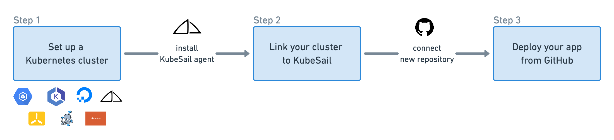

# Deploy your app

Once you have a running Kubernetes cluster, you can deploy your containerized applications on top of it. Follow these steps to set up and run a Kubernetes cluster and deploy your first app.

- [Deploy your app](#deploy-your-app)
  - [Step 1: Set up a Kubernetes cluster](#step-1-set-up-a-kubernetes-cluster)
    - [Managing your own cluster](#managing-your-own-cluster)
    - [Managed cloud services](#managed-cloud-services)
  - [Step 2: Link your cluster to KubeSail](#step-2-link-your-cluster-to-kubesail)
  - [Step 3: Deploy from GitHub repository](#step-3-deploy-from-github-repository)

](img/deploy-from-repo.png)

## Step 1: Set up a Kubernetes cluster

There's a few options to set up and run a Kubernetes cluster. You can either run Kubernetes on a local machine, or use a managed Kubernetes provider. Depending on where you choose to run Kubernetes, the setup steps are different.

### Managing your own cluster

Installing Kubernetes on your own machine, a dedicated computer, or Raspberry Pi is ideal for a **learning environment**. There's several options for running Kubernetes locally.

-   [Docker Desktop](/install_kubernetes/#docker-desktop)
-   [Microk8s](/install_kubernetes/#microk8s)
-   [K3s](/install_kubernetes/#k3s)
-   [Kubernetes the Hard Way](/install_kubernetes/#kubernetes-the-hard-way)

### Managed cloud services

Running Kubernetes on a managed cloud service is ideal for a **production environment**. These services come with Kubernetes pre-installed. There's several options for provisioning a cluster.

-   EKS
-   GKE
-   Digital Ocean
-   [Chat with us about managed options](https://kubesail.typeform.com/to/lFZF2r)

## Step 2: Link your cluster to KubeSail

Wherever and whatever your cluster is, you can link it to KubeSail from the dashboard under [**Clusters**](https://kubesail.com/clusters/), click **+ Add Cluster**.

](img/clusters-add-cluster.png)

To add your cluster to KubeSail, apply the configuration file to your cluster using `kubectl`:

    kubectl apply -f https://byoc.kubesail.com/<your-kubesail-username>.yaml

## Step 3: Deploy from GitHub repository

From the KubeSail dashboard under [**Repos**](https://kubesail.com/repos), click **Connect New Repository**, and select which repo you want to install the KubeSail DeployBot. You can grant access to selected repositories within the user or organization's account.

](img/deployboy-permissions.png)

Once you grant KubeSail access to a GitHub repository, it appears under **Repos** within the KubeSail dashboard.

Select the newly added repository to view the suggested pipeline. Pick a branch to build and a Kubernetes context from the dropdowns, and then click **Build Now**. You can view the build logs beneath your pipeline.

](img/repos-pipeline-build.png)

Once your app successfully builds and deploys, it appears under **Apps** within the KubeSail dashboard.
