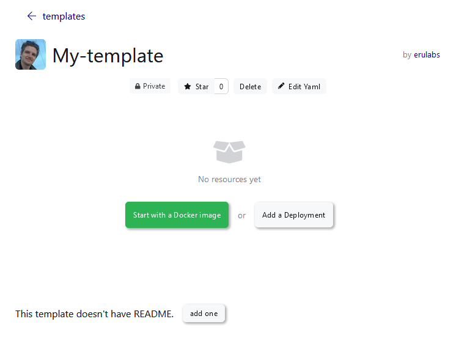

# KubeSail Templates

The KubeSail Templates help you quickly install and share Kubernetes applications.

Templates can be shared with others, re-used on your clusters, and used to create a KubeSail Platform feature to re-sell yout software!

- [View our Official templates](https://kubesail.com/templates?official=1)
- [View public templates](https://kubesail.com/templates)
- [Create a new template](https://kubesail.com/template)

## Creating a new Template:

Visit https://kubesail.com/template and Choose a **public** or **private** template

- Public templates are visible to everyone - Be careful not to include sensitive information!
- Private templates are only visible to you and members of your organization

](img/templates-new.png)

## Getting started:

- Choose **"Start with a Docker image"** if you have a public Docker image you'd like to use - we'll automatically generate most of the Kubernetes YAML you'll need to get started!
- Choose **"Add a Deployment"** to see a minimal example of a Kubernetes Deployment object. You may want to review [the Kubernetes documentation](https://kubernetes.io/docs/concepts/workloads/controllers/deployment/) for more information about Deployments.
- Choose **"Edit YAML"** if you already have Kubernetes YAML you'd like to use.

## Adding resources:

You can add common Kubernetes resources using the **"+"** icon in the Editor.

](img/templates-add-resource.png)

## Editing resources:

You can use the YAML editor on the right to create any custom resource you'd like. However, for most common resource-types, you can also click on the resource on the left and use more friendly tools to modify the resources:

](img/templates-lefthand.png)

## Variables

You can create special variables that will require user-input before launching. This is very useful for configuration that will need to be different for each user who installs this template. Variables are formatted like `"{{ VARIABLE_NAME }}"`. Variables must be quoted, and can only be strings.

Creating a variable will automatically add the "Environment Variable" panel to the left-hand side:

](img/templates-envvars.png)

Environment variables can also be upgraded a bit to help users by giving them defaults and descriptions about how they should be used. The format is:

    `"{{ VARIABLE_NAME|default value|Description }}"`

You can also use `RANDOM(length)` as a default value to generate random strings such as passwords:

](img/templates-varfunctions.png)

Variables which have no default value -must- be completed by a user before the Template can be launched.

As always, please let us know [in our discord channel](https://discord.gg/N3zNdp7jHc) if you have any questions or if you need a hand building an awesome template!
