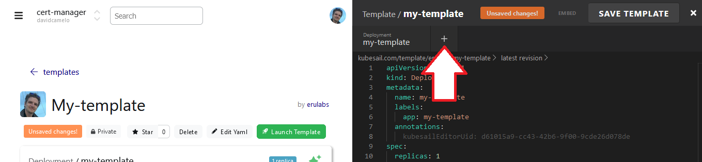
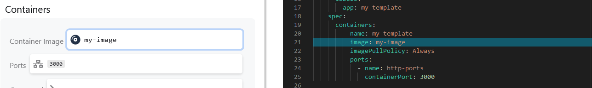
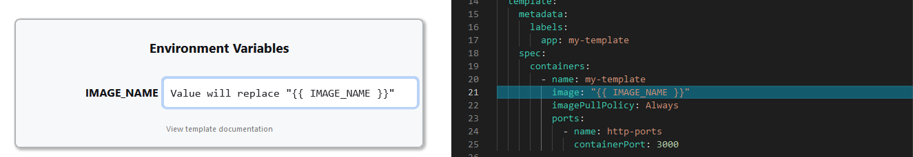
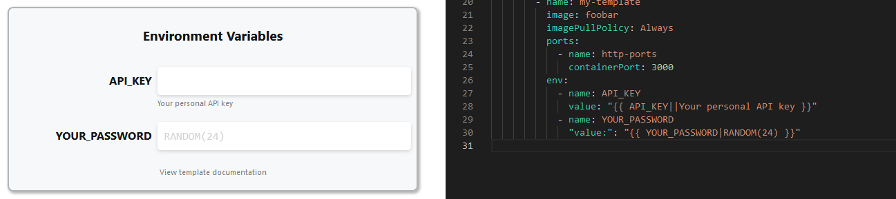

# Templates

**Templates** allow you to easily install and share applications.

Templates can be shared with others, re-used on your clusters, and used to create a [Platform](/platform) to resell your software! Check out our [Official templates](https://kubesail.com/templates?official=1) or see all [public templates](https://kubesail.com/templates) to get started!

### Creating a new Template

Visit [https://kubesail.com/template/new](https://kubesail.com//template/new).

### Getting started

- Choose **"Start with a Docker image"** if you have a public Docker image you'd like to use - we'll automatically generate most of the Kubernetes configuration you'll need!
- Choose **"Add a Deployment"** to see a minimal example of a Kubernetes Deployment
- Choose **"Edit YAML"** to open the built-in YAML Editor

### Public / Private
When you first save your new template, you can choose **public** or **private**.

- Public templates are visible to everyone - Be careful not to include sensitive information!
- Private templates are only visible to you and members of your organization

### Adding resources

You can add common Kubernetes resources using the **"+"** icon in the Editor.

](img/templates-add-resource.png)

### Editing resources

You can use the YAML editor on the right to create any custom resource you'd like. However, for most common resource-types, you can also click on the resource on the left and use more friendly tools to modify the resources:

](img/templates-lefthand.png)

### Template Variables

You can create special variables that will require user-input before launching. This is very useful for configuration that will need to be different for each user who installs this template. Variables are formatted like `"{{ VARIABLE_NAME }}"`. Variables must be quoted, and can only be strings.

Creating a variable will automatically add the "Environment Variable" panel to the left-hand side:

](img/templates-envvars.png)

Environment variables can also be upgraded a bit to help users by giving them defaults and descriptions about how they should be used. The format is:

    `"{{ VARIABLE_NAME|default value|Description }}"`

You can also use `RANDOM(length)` as a default value to generate random strings such as passwords:

](img/templates-varfunctions.png)

Variables which have no default value -must- be completed by a user before the Template can be launched.

As always, please let us know [in our discord channel](https://discord.gg/N3zNdp7jHc) if you have any questions or if you need a hand building an awesome template!

### Special Variables

`KS_NAMESPACE` will be replaced with the name of the namespace this template is launched in. This is useful for `Ingress` names for apps which may be installed in many namespaces. For example `{{ KS_NAMESPACE }}.mycluster.myapp.com` is useful for user-installations of templates, including [Platform](/platform).

### Variable Table
|Variable| Function | Example
|--|--|--|
| {{ CLUSTER_ADDRESS }} | Will Use the Cluster Address for the URL. | pibox.erulabs.use1.k8g8.com |
| RANDOM(x) | Will Return a Random Generated String. Can be Used for Passwords, Keys, ETC. |RANDOM(18) = `gPDs9y3zh7QYkq3FCU` |
| SRANDOM(x) |  Will Return a Random Generated String. | SRANDOM(18) = `&K9W28*5S!bG4Pu%*b`|
| {{ TZ() }} | Used for Timezone Funtions in a Template, can be used as a default. |Ex: {{ TIMEZONE|TZ() }}|

